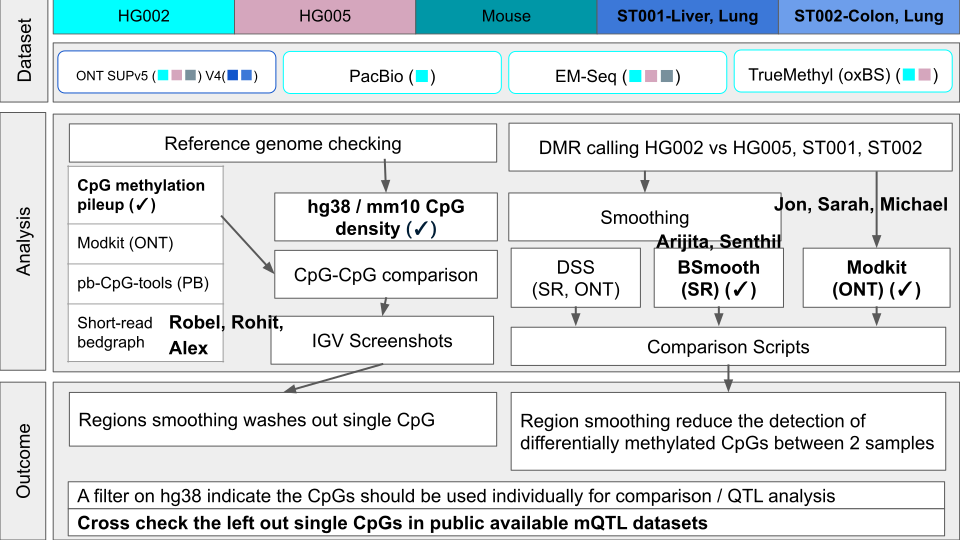
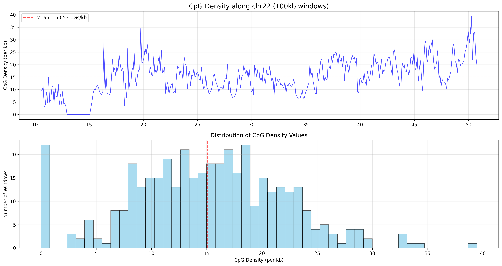

# MethSmoothEval (Group 6 - 2025 BCM HGSC SVcrying Hackathon)
## Group members
[Yilei Fu](https://github.com/Fu-Yilei),
[Robel Dagnew](https://github.com/redndgreen8), 
[Jon Moller](https://github.com/molleraj),
[Rohit Kolora](https://github.com/evolgen),
[Alex Leonard](https://github.com/ASLeonard),
[Halimat Atanda](https://github.com/chisomgold), 
[Arijita Sarkar](https://github.com/arijita88),
[Senthilkumar Kailasam](https://github.com/dksenthil),
[Zahra Seyfollahi](https://github.com/ZSeyfollahi),
Nilabja Bhattacharjee,
[Sarah Eger](https://github.com/saraheger),
[Michael Olufemi](https://github.com/michael-olufemi),
[Ben Braun](https://github.com/bennibraun)
## Pipeline flowchart

## Introduction
While the gold standard for DNA methylation detection is bisulfite sequencing, the advent of long-read sequencing has made it possible to detect DNA methylation and additional modifications in native nucleic acid. The goal of this project is to evaluating effects of smoothing on long read methylation calling.
## Methods
## Results

## Discussion
## References
=======
