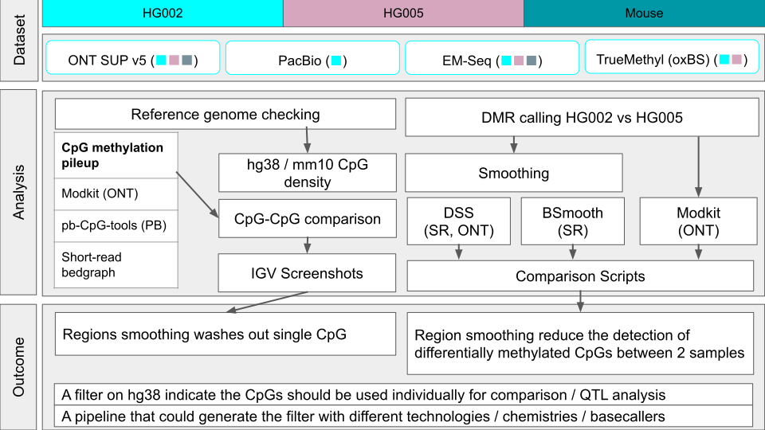

# Smoothing Effect on Methylation Signals (MethSmoothEval)

Flowchart of MethSmoothEval

## 🎯 Target
This project investigates whether smoothing of DNA methylation signals—historically essential in short-read bisulfite sequencing (WGBS)—is still necessary in the era of high-accuracy long-read sequencing (ONT, PacBio).  

We aim to benchmark **single-CpG vs smoothed-CpG analysis** to assess:  
- When smoothing improves detection of differentially methylated CpGs/regions (DMCpGs/DMRs).  
- When smoothing introduces artifacts or masks true single-CpG variation.  
- Whether per-read accuracy and sequence context in ONT impact CpG methylation detection.  

## 📝 Plan
1. **Data Sources**  
   - Short-read: SEQC2 EpiQC data (WGBS / EM-Seq / oxidative bisulfite sequencing).  
   - Long-read: ONT datasets (HG002, HG005).  

2. **Benchmarking**  
   - Run smoothing-based tools: `BSmooth`, `DSS`.  
   - Run long-read tools: `Modkit`, `pb-CpG-tools`.  
   - Compare per-CpG and DMR calls across technologies.  

3. **Key Analyses**  
   - CpG density profiling across hg38 (focus on chr22 in hackathon).  
   - Evaluate whether smoothing disrupts single-CpG interpretation (e.g., IGV inspection of low vs high DNAm CpGs in proximity).  
   - Identify counter-examples where ONT single-CpGs are biologically informative but missed in short-read smoothing pipelines.  
   - Assess tissue-specific effects (blood vs brain vs tumor).  

4. **Validation**  
   - Cross-check ONT read-level calls with EM-Seq / TrueMethyl.  
   - Ask: Are ONT-only CpG calls false positives, or do they reflect true biological signal?  

## 📊 Output
- **Catalog of CpG regions on hg38 (chr22 focus)**  
  - Where single-CpG analysis is reliable.  
  - Where smoothing remains necessary.  
- **Benchmarking pipeline**  
  - Reproducible and fast for new long-read chemistries.  
  - Extensible to tissue- and cell-type–specific studies.  
- **Case Studies**  
  - Examples of ONT CpGs not recovered by EM-Seq smoothing.  
  - Markers distinguishing HG002 vs HG005.  
- **Follow-up Questions**  
  - Sequence context dependencies for CpG calling accuracy.  
  - Reliability of methylation calling in repetitive / TR regions.  
  - Tissue-specific CpG resolution requirements.  
