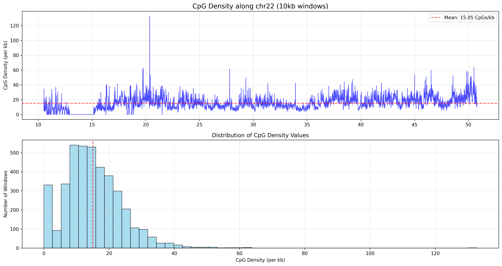

# CpG Density Analyzer

Analyzes CpG methylation density from BED files using sliding genomic windows.

## How it works

1. **Loads BED file** containing CpG site positions (chr, start, end)
2. **Divides chromosome** into fixed-size windows (default: 100kb)
3. **Counts CpG sites** in each window
4. **Calculates density** as CpGs per kilobase for each window
5. **Generates plots** showing density along the chromosome

## Usage

### Basic analysis
```bash
python cpg_density.analyzer.py data.bed.gz --chromosome 22
```

### Custom parameters
```bash
# Different window size
python cpg_density.analyzer.py data.bed.gz --chromosome 22 --window-size 50000

# Save data and plots
python cpg_density.analyzer.py data.bed.gz --chromosome 22 --output results/ --save-data

# Analyze all chromosomes (no window analysis)
python cpg_density.analyzer.py data.bed.gz
```

## Command line options

| Option | Description | Default |
|--------|-------------|---------|
| `input_file` | Input BED file (can be gzipped) | Required |
| `--chromosome`, `-c` | Analyze specific chromosome (e.g., 22, chr22) | All chromosomes |
| `--window-size`, `-w` | Window size in bp | 100000 |
| `--output`, `-o` | Output directory | Current directory |
| `--no-plots` | Skip generating plots | Generate plots |
| `--save-data` | Save density data to CSV | Don't save |

## Calculations

### Basic statistics
- **Total CpG sites**: Count of all CpG positions
- **Genomic span**: Distance from first to last CpG
- **Overall density**: `total_cpgs / (genomic_span / 1000)` CpGs per kb

### Window analysis
For each window:
- **Window density** = `cpgs_in_window / (window_size / 1000)`
- **Statistics**: Mean, standard deviation, and maximum density across all windows

### Example calculation
- Window: 100,000 bp (100 kb)
- CpG sites in window: 150
- **Density = 150 ÷ 100 = 1.5 CpGs per kb**

## Output files

### Plots (PNG format)
- `cpg_per_chromosome.png` - CpG distribution across chromosomes (if multiple)
- `{chr}_cpg_density_{window_size}kb.png` - Two-panel plot:
  - **Top**: Density profile along chromosome (with mean line)
  - **Bottom**: Histogram of density values

### Data files (if `--save-data` used)
- `{chr}_density_{window_size}kb.csv` - Raw density data

**CSV columns:**
```
chr,window_start,window_end,window_center,cpg_count,density_per_kb
chr22,16050000,16150000,16100000,45,0.45
chr22,16150000,16250000,16200000,120,1.20
```

## Console output example

```
Loading data.bed.gz...
Filtered to chr22: 45,678 CpG sites

=== Basic Statistics ===
Chromosome: chr22
CpG sites: 45,678
Genomic span: 16,050,000 - 51,244,566
Total length: 35.19 Mb
Overall density: 1.30 CpGs per kb

=== Window Analysis (100kb windows) ===
Analyzing chr22: 16,050,000 - 51,244,566
Created 352 windows
Mean density: 1.30 CpGs/kb
Std density: 1.85 CpGs/kb
Max density: 12.45 CpGs/kb
```

### CpG density in HG002 (10kb)



## Interpretation

- **High density regions** (>3 CpGs/kb): Potential CpG islands
- **Low density regions** (<1 CpG/kb): Typical genomic background
- **Peaks in density plot**: Regions of interest for further analysis

## Requirements

```python
pandas
matplotlib
numpy
argparse
gzip
```

## Input file format

Standard BED format (tab-separated):
```
chr1    1000    1001
chr1    1050    1051
chr1    1200    1201
...
```

Supports both compressed (.gz) and uncompressed files.


# PacBio CpG Pileup Analysis with pb-cpg-tools

This README documents the analysis pipeline using pb-cpg-tools in pileup mode to generate smoothed and unsmoothed CpG methylation data, followed by BigWig visualization to identify methylation differences.

## Overview

The analysis uses pb-cpg-tools with the `--pileup-mode model` and `--pileup-mode count` option to:
1. Generate CpG methylation calls from aligned BAM files
2. Create both smoothed and unsmoothed count data
3. Convert to BigWig format for genome browser visualization
4. Compare methylation patterns between different conditions/samples

## Prerequisites

```bash
# Install pb-cpg-tools via conda
conda create -n pb-cpg pb-cpg-tools samtools bedtools
conda activate pb-cpg

pip install pyBigWig matplotlib seaborn
```

## Input Requirements

- **Aligned BAM files**: PacBio HiFi reads aligned to reference genome
- **BAM index files**: Corresponding .bai files
- **Reference genome**: FASTA file used for alignment

## Pipeline Steps

### 1. Generate CpG Pileup Data - Model Mode (Smoothed)

```bash
# Run pb-cpg-tools with model mode for smoothed output
aligned_bam_to_cpg_scores pileup \
  --bam HG002.pacbio.chr22.bam \
  --output-prefix HG002_chr22_model \
  --pileup-mode model \
  --threads 8 \
  --min-coverage 5

# This generates:
# - HG002_chr22_model.bed.gz          # Smoothed methylation data
# - HG002_chr22_model.bw              # Smoothed BigWig (auto-generated)
```

### 2. Generate CpG Pileup Data - Count Mode (Unsmoothed)

```bash
# Run pb-cpg-tools with count mode for raw counts
aligned_bam_to_cpg_scores pileup \
  --bam HG002.pacbio.chr22.bam \
  --output-prefix HG002_chr22_count \
  --pileup-mode count \
  --threads 8 \
  --min-coverage 5

# This generates:
# - HG002_chr22_count.bed.gz          # Raw count data (unsmoothed)
# - HG002_chr22_count.bw              # Unsmoothed BigWig (auto-generated)
```

### 3. Understanding the Two Modes

#### Model Mode (Smoothed)
- **Output**: `HG002_chr22_model.bed.gz` & `HG002_chr22_model.bw`
- **Content**: Machine learning model-based smoothed methylation estimates
- **Characteristics**: Reduces noise, shows regional patterns
- **Use**: Regional methylation analysis, identifying domains

#### Count Mode (Unsmoothed)  
- **Output**: `HG002_chr22_count.bed.gz` & `HG002_chr22_count.bw`
- **Content**: Raw read counts converted to methylation ratios
- **Characteristics**: Site-specific resolution, higher variability
- **Use**: Single-CpG resolution analysis, detecting specific sites

### 4. BigWig Comparison Analysis

Since pb-cpg-tools automatically generates BigWig files, you can directly compare model vs count modes

#### IGV example of discrepancies


#### Running the Mode Comparison

```bash
# Compare model vs count modes for a specific region
python3 compare_methylation_modes.py \
  --model HG002_chr22_model.bw \
  --count HG002_chr22_count.bw \
  --region chr22:20000000-25000000 \
  --output HG002_chr22_comparison
```

#### Both modes analyze identical CpG sites, but the model mode is doing value processing, not position filtering


#### Pileup comparison and smoothing effect


## Genome Browser Visualization

### Loading in IGV

```bash
# Load both BigWig files in IGV to compare side-by-side:
# File -> Load from URL or local file paths:
# - HG002_chr22_count.bw (unsmoothed)
# - HG002_chr22_model.bw (smoothed)
```

## Key Observations from BigWig Comparison

### Biological Interpretations

- **Count mode**: Best for identifying individual CpG sites and high-resolution analysis
- **Model mode**: Better for identifying methylation domains, regulatory regions, and patterns

## Output File Summary

| File | Description | Mode | Use Case |
|------|-------------|------|----------|
| `*_model.bed.gz` | ML model-based smoothed methylation | Model | Regional analysis, domains |
| `*_model.bw` | Smoothed methylation BigWig | Model | Genome browser (smooth tracks) |
| `*_count.bed.gz` | Raw count-based methylation ratios | Count | Site-specific analysis |
| `*_count.bw` | Raw methylation BigWig | Count | Genome browser (detailed tracks) |

## Next Steps

1. **Differential Analysis**: Perform DMR analysis 
2. **Functional Annotation**: Overlap with gene features, regulatory elements
4. **Integration**: Combine with other epigenomic datasets (ChIP-seq, ATAC-seq)

## References

- **pb-cpg-tools documentation**: [PacBio GitHub](https://github.com/PacificBiosciences/pb-cpg-tools)
- **BigWig format specification**: [UCSC Genome Browser](https://genome.ucsc.edu/goldenPath/help/bigWig.html)
